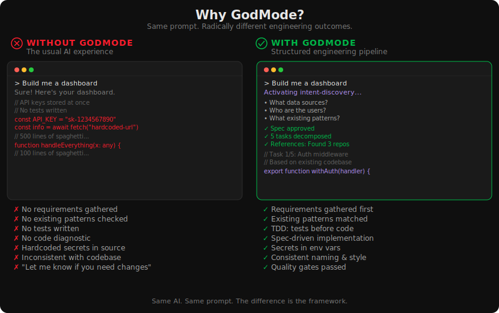

<p align="center">
  
</p>

<p align="center">
  <a href="#install"></a>
  <a href="LICENSE"></a>
  
  
</p>

<p align="center">
  An engineering framework for AI coding agents.<br>
  Stop hoping your agent writes good code — make it.
</p>

## Quick Start

```bash
claude plugin marketplace add NoobyGains/godmode
claude plugin install godmode
```

That's it. Start your next conversation — GodMode activates automatically.

---

<p align="center">
  
</p>

## The Problem

AI coding agents have a predictable failure mode: you ask for a feature, and they immediately start writing code. No questions about requirements. No check for existing patterns. No tests. No spec. Just a wall of generated files and a "let me know if you need changes."

<p align="center">
  
</p>

The result is code that works in isolation but clashes with everything around it. Inconsistent naming. Duplicated logic. Tests bolted on after the fact. Entire components built from scratch when a solid open-source solution already exists. You end up spending more time fixing the agent's output than you would have spent writing it yourself.

GodMode fixes this. It is a 37-skill system that activates automatically and governs the full development lifecycle — from the first question about requirements through to a merged pull request.

## How It Works

GodMode operates as a five-phase gated pipeline. The agent cannot advance until each phase meets its exit criteria.

<p align="center">
  
</p>

**DEFINE** — The agent interrogates the problem space. It asks targeted questions one at a time, surfaces trade-offs, researches proven references, presents 2-3 approaches with rationale, and produces a spec document. Nothing moves forward until you approve it.

**PLAN** — The approved spec is decomposed into atomic tasks (2-5 minutes each). Every task includes exact file paths, complete code snippets, shell commands with expected output, and pass/fail criteria. Ambiguity dies here.

**EXECUTE** — Fresh subagents receive individual tasks and work in isolation. Test-driven development is mandatory: write a failing test, make it pass, refactor, commit. A two-stage review (spec compliance + code quality) runs after every task.

**REVIEW** — Completed work is evaluated against the original spec, then against code quality standards. Issues are severity-ranked. Critical findings block forward progress until resolved.

**SHIP** — End-to-end test verification. The agent presents options: merge, open a PR, keep the branch, or discard. Worktrees are cleaned up. Nothing left dangling.

## Dynamic Execution Routing

GodMode doesn't just have one way of working. It analyzes your task and automatically selects the optimal execution mode:

```
Task arrives
    │
    ├── Single atomic step?
    │   └── YES → Handle directly (no orchestration)
    │
    ├── Multiple independent parts?
    │   ├── Need peer coordination? → Agent Teams
    │   └── No coordination needed? → Parallel Execution
    │
    └── Multi-step sequence?
        └── YES → Delegated Execution (sequential + review gates)
```

### Four Execution Modes

**Direct** — Simple tasks that don't need decomposition. Config changes, typo fixes, single-file modifications.

**Delegated Execution** — Sequential multi-step implementation. A fresh subagent handles each task, followed by a spec compliance audit and a code quality audit. The controller never loses context because it curates exactly what each subagent needs.

**Parallel Execution** — Independent problems dispatched to concurrent agents. Each agent works in isolation with a focused brief. Results are reconciled and integration-tested after all agents report back. Used for multi-domain debugging, distributed investigation, independent test fixes.

**Agent Teams** — Multiple Claude instances collaborating via peer-to-peer messaging, each in its own git worktree. Teammates can share discoveries mid-work, negotiate interfaces in real-time, and coordinate on shared problems. Used for multi-module features, codebase migrations, and diagnosis of complex issues.

The system decides automatically. You say "build me a dashboard" and GodMode figures out whether that's a 3-agent team job or a sequential delegation.

## Agent Teams

This is the most powerful execution mode. When a task has multiple parts that need to share discoveries or coordinate interfaces, GodMode deploys a team of 2-5 Claude instances that work simultaneously.

### How It Works

```
1. ENUMERATE — List all tasks
2. MAP — Which tasks need information from each other?
3. COUNT — How many task pairs require collaboration?
   0 pairs → Parallel execution (no team needed)
   1 pair  → Consider single agent
   2+ pairs → Deploy Agent Teams
4. ASSIGN — Each teammate gets clear file ownership (no shared files)
5. EXECUTE — Teammates work in parallel, messaging each other as needed
6. INTEGRATE — Team lead merges results, runs full test suite
```

### What This Looks Like in Practice

**Scenario: Add subscription billing (React frontend + Node backend + Stripe)**

```
Team: billing-feature-team (3 teammates + lead)

backend-eng:  Define Stripe API contract → Implement endpoints → Webhook handler
frontend-eng: Build billing UI with mock → Integrate webhooks into UI
qa-eng:       Write end-to-end tests (waits for backend + frontend)

Coordination:
  Frontend discovers API needs paymentMethodId field
  → Messages backend directly: "Need paymentMethodId in subscription response"
  → Backend adjusts contract, continues
  → Frontend adapts, continues
  → No context switching. No replanning. No blocking.
```

Each teammate works in its own git worktree. No merge conflicts. The lead monitors progress, relays discoveries between teammates, and unblocks dependencies.

### Team Patterns

| Pattern | When to use | Example |
|---|---|---|
| **Feature Team** | Frontend + backend + tests for one feature | Billing, dashboard, auth flow |
| **Exploration Team** | Parallel investigation of unknowns | Evaluating 3 libraries simultaneously |
| **Diagnosis Team** | Competing hypotheses tested in parallel | Latency spike with multiple suspects |
| **Migration Team** | Cross-module refactor with shared conventions | Callback-to-async migration across 4 modules |
| **Inspection Team** | Multi-perspective code review | Security + performance + architecture review |

## Reference-First Development

Before writing a single line of code, GodMode searches for proven implementations:

- **GitHub repos** — Minimum 3 distinct search queries across 2+ channels before declaring "nothing exists." Evaluates stars, maintenance, community health, license, test coverage, dependency footprint.
- **Design marketplaces** — ThemeForest, Webflow, Framer, Awwwards, Dribbble. Maps your niche (fitness, SaaS, legal) to specific section patterns used by premium templates.
- **Your existing codebase** — Surveys 2-3 similar files, catalogs conventions (naming, error handling, validation patterns, test structure), and replicates them exactly.
- **Architecture references** — Stripe API patterns for payment systems, Supabase schemas for multi-tenant, Discord's gateway for WebSocket, Cal.com for subscription lifecycle.

The principle: every professional implementation represents months of iteration, thousands of users, production incidents, and security audits. You inherit all of that when you use a reference. You inherit none of it when you generate from scratch.

## Quality Gates

Every piece of code passes through systematic verification. This is not optional.

### Per-Task Review (After Each Task)

1. **Spec Compliance Audit** — Does the implementation match the specification exactly? Nothing more, nothing less.
2. **Code Quality Audit** — Is it well-crafted, maintainable, and consistent with the codebase?
3. **Test Verification** — Red-green-refactor cycle confirmed. Tests fail without the fix, pass with it.

### Pre-Landing Checks (7 Mandatory)

| Check | Threshold |
|---|---|
| Lint | Zero errors, zero warnings |
| Type Safety | Strict mode, no `any` escape hatches |
| Test Coverage | 80% line, 70% branch, 90% new code |
| Build | Clean, no warnings |
| Bundle Size | Under budget |
| Dependency Audit | Zero critical/high vulnerabilities |
| Complexity | No function exceeding 10 cyclomatic |

### Completion Gate

Before declaring anything "done," the agent must produce fresh terminal output proving:
- Tests pass (not "they should pass" — actual output showing 0 failures)
- Linter clean (actual output showing 0 errors)
- Build succeeds (actual exit code 0)

Hedging language like "should work" or "probably passes" is prohibited.

## The 37 Skills

Every skill has a **Prime Directive** (a non-negotiable rule), **Cognitive Traps** (rationalizations to watch for), and **Guardrails** (what's prohibited). They compose for full workflows or fire independently.

<details>
<summary><strong>Core Workflow</strong> (6 skills)</summary>

| Skill | Prime Directive |
|---|---|
| `activation` | Invoke applicable skills before generating any response |
| `rationale` | No work without questioning whether the work is worth doing |
| `intent-discovery` | No implementation without validated design first |
| `task-planning` | No implementation without a plan first |
| `task-runner` | No plan execution without critical review of each task |
| `completion-gate` | No completion assertions without fresh verification output |

</details>

<details>
<summary><strong>Execution Patterns</strong> (5 skills)</summary>

| Skill | Prime Directive |
|---|---|
| `delegated-execution` | Fresh subagent per task + two-stage review |
| `parallel-execution` | No concurrent dispatch without confirming isolation |
| `team-orchestration` | No team without a collaboration requirement |
| `agent-messaging` | No agent dispatch without a structured brief |
| `workspace-isolation` | No feature work on the main branch |

</details>

<details>
<summary><strong>Quality and Review</strong> (4 skills)</summary>

| Skill | Prime Directive |
|---|---|
| `quality-gate` | No landing without review |
| `review-response` | Every piece of feedback gets technical evaluation |
| `quality-enforcement` | No code lands without all quality checks passing |
| `comprehension-check` | No commit until every change is understood |

</details>

<details>
<summary><strong>Research and References</strong> (4 skills)</summary>

| Skill | Prime Directive |
|---|---|
| `reference-engine` | No building without a reference |
| `github-search` | No building from scratch without searching GitHub first |
| `codebase-research` | No new code without understanding existing code first |
| `design-research` | No website layout without template research first |

</details>

<details>
<summary><strong>Development Practices</strong> (6 skills)</summary>

| Skill | Prime Directive |
|---|---|
| `test-first` | No production code without failing test first |
| `specification-first` | No implementation without specification first |
| `fault-diagnosis` | No fixes without root cause investigation first |
| `error-recovery` | No continued attempts without acknowledging failure count |
| `merge-protocol` | No integration without passing tests |
| `pattern-matching` | Every addition must mirror an existing precedent |

</details>

<details>
<summary><strong>Architecture and Design</strong> (4 skills)</summary>

| Skill | Prime Directive |
|---|---|
| `system-design` | No structural complexity without an established requirement |
| `ui-engineering` | No component without structure, states, and accessibility defined |
| `design-integration` | Never rebuild what the design system already provides |
| `ux-patterns` | No UI code without a UX reference first |

</details>

<details>
<summary><strong>Infrastructure and Operations</strong> (6 skills)</summary>

| Skill | Prime Directive |
|---|---|
| `project-bootstrap` | No feature code before project structure is established |
| `environment-awareness` | No shell commands without knowing the target environment |
| `deployment-advisor` | No technology recommendation without checking what the user already has |
| `performance-tuning` | No optimization without measurement proving the problem |
| `security-protocol` | No external data reaches system call/query/output without validation |
| `memory-manager` | No memory storage without type, confidence, and tags |

</details>

<details>
<summary><strong>Meta</strong> (2 skills)</summary>

| Skill | Prime Directive |
|---|---|
| `protocol-authoring` | TDD applied to process documentation (red/green/refactor for skills) |
| `knowledge-capture` | Extract insight from every meaningful interaction |

</details>

## Three-Tier Priority

When skills conflict, GodMode resolves them with a strict hierarchy:

```
1. PROJECT (highest) — Your project's /skills directory
2. PERSONAL (middle)  — Your personal custom skills
3. GODMODE (lowest)   — Built-in defaults
```

Your codebase conventions always win. If your project has a custom `authentication` skill, it shadows GodMode's version. You can override any skill without modifying the framework.

## Install

### Claude Code

```bash
claude plugin marketplace add NoobyGains/godmode
claude plugin install godmode
```

Then start any conversation. GodMode activates automatically via the SessionStart hook. Run `/godmode` to explicitly invoke it, or just start working — the activation skill detects relevant context and fires the right skills.

### Other Platforms

| Platform | Method |
|---|---|
| **Cursor** | Plugin manifest at `.cursor-plugin/plugin.json` |
| **OpenCode** | Plugin at `.opencode/plugins/godmode.js` |
| **Codex** | Symlink skills to Codex config directory |

Each skill is a standalone Markdown file. Any AI agent that can read files can consume them.

## Validation

Every skill is machine-validated on every change:

```bash
npm run validate
```

Checks all 37 skills for structural correctness, required frontmatter fields, cross-references, and internal consistency. Runs automatically in CI.

## How This README Was Built

This README was built using GodMode itself:

1. **intent-discovery** — Defined audience (developers), tone (professional), and sections needed
2. **reference-engine** — Studied READMEs from Aider, Ruff, LobeChat, and top dev tool repos with 10K+ stars
3. **design-research** — Referenced Linear, Stripe, and Vercel for visual design language
4. **team-orchestration** — Dispatched parallel agent teams: skill researcher, README writer, SVG designer, execution routing mapper
5. **ux-patterns** — Eliminated 14 amateur anti-patterns from the SVG visuals (no typewriter gimmicks, no floating particles, no gratuitous animations)
6. **quality-enforcement** — Playwright-verified every SVG renders correctly on GitHub
7. **completion-gate** — Screenshot verification of the final result on github.com

## What GodMode is NOT

- **Not a replacement for thinking.** GodMode structures how your agent approaches work. You still make the decisions.
- **Not magic.** It's composable engineering discipline encoded as skills — no black boxes, no hidden prompts.
- **Not a code generator.** It governs *how* the agent works, not *what* it builds. Your codebase, your architecture, your calls.
- **Not framework-specific.** Works with any language, any stack, any project size. The skills are language-agnostic by design.
- **Not slow.** Skills are Markdown files resolved at conversation start. The overhead is near-zero — milliseconds, not seconds.
- **Not locked-in.** MIT licensed. Every skill is a standalone Markdown file. Fork it, modify it, strip it for parts — it's yours.

## Contributing

Open an issue or submit a PR. If you are adding a new skill, use the `protocol-authoring` skill to generate it — it enforces correct structure using TDD applied to process documentation.

## License

MIT — see [LICENSE](LICENSE).

Built by [David](https://github.com/NoobyGains).
