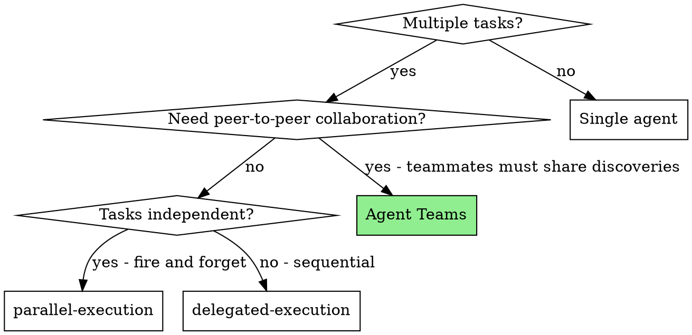
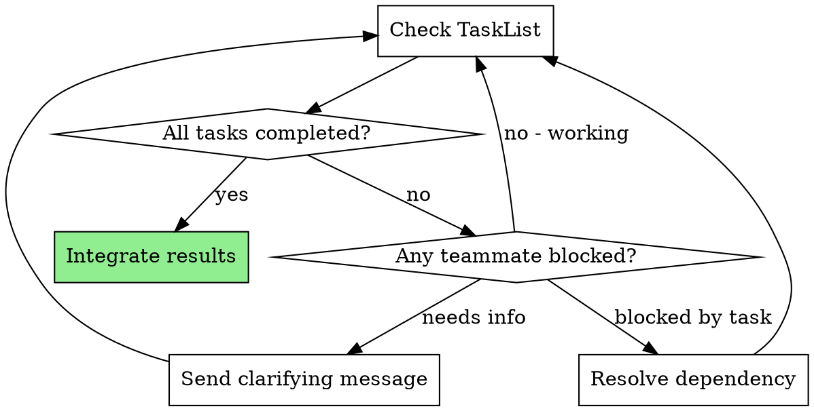

# Team Orchestration

## Overview

Agent Teams enable multiple Claude Code sessions to collaborate on a shared project with direct peer-to-peer messaging and shared task lists. Unlike subagents, teammates can communicate with each other, claim tasks dynamically, and coordinate on shared problems.

**Core principle:** Deploy teams when tasks benefit from collaboration, not merely parallelism. If teammates will never need to message each other, use parallel subagents instead.

**No exceptions. No workarounds. No shortcuts.**

## The Prime Directive

```
NO TEAM WITHOUT A COLLABORATION REQUIREMENT
```

If teammates will never exchange messages, you do not need a team.

## When to Use



**Deploy Teams when:**
- Parallel research where discoveries from one investigation redirect another
- Multi-module features where frontend/backend/tests must coordinate
- Cross-layer changes requiring interface negotiation
- Debugging with competing hypotheses that need to share evidence
- Large refactoring across multiple subsystems with shared conventions

**Do not use when:**
- Simple independent tasks (use godmode:parallel-execution)
- Sequential dependent tasks (use godmode:delegated-execution)
- Single-file or single-module changes
- Agent Teams feature not enabled
- Fewer than 2 genuinely collaborative tasks

## Prerequisites

Agent Teams is an experimental feature. It must be enabled:

```
CLAUDE_CODE_EXPERIMENTAL_AGENT_TEAMS=true
```

Without this, TeamCreate, TaskCreate, and SendMessage tools are unavailable.

## The Entry Protocol

```
BEFORE forming a team:

1. ENUMERATE: What are all the tasks?
2. MAP: Which tasks need information from other tasks?
3. COUNT: How many task pairs require shared discoveries?
4. DECIDE:
   - 0 pairs need collaboration -> Use parallel-execution
   - 1 pair needs collaboration -> Consider single agent or subagents
   - 2+ pairs need collaboration -> Use Agent Teams
5. ONLY THEN: Form the team

Skip any step = unnecessary team overhead
```

## The Workflow

### Step 1: Evaluate Task-Team Fit

Before reaching for TeamCreate, answer these:

| Question | If Yes | If No |
|----------|--------|-------|
| Can a single agent handle this? | Do that instead | Continue |
| Can parallel subagents handle this? | Use parallel-execution | Continue |
| Do agents need to share discoveries mid-work? | Teams | Subagents |
| Do agents need to negotiate interfaces? | Teams | Subagents |
| Is coordination overhead justified? | Teams | Simpler approach |

### Step 2: Architect the Team

```
Use TeamCreate:
- Name: descriptive-kebab-case (e.g., "auth-refactor-team")
- Teammates: 2-5 (more = exponential coordination overhead)
- Each teammate gets: name, role description, clear scope
```

**Teammate count guidance:**

| Count | When | Coordination Cost |
|-------|------|-------------------|
| 2 | Two distinct modules that must agree on interface | Low |
| 3 | Frontend + backend + tests, or 3 independent subsystems | Medium |
| 4 | Cross-cutting refactor with 4 modules | High |
| 5 | Maximum — only for genuinely large efforts | Very High |

### Step 3: Define Tasks with Clear Boundaries

```
Use TaskCreate for each task:
- Clear scope: exactly which files/modules this teammate owns
- Dependencies: blockedBy for tasks that must complete first
- Success criteria: what "done" looks like
- File ownership: NO overlap between teammates (prevents merge conflicts)
```

**File ownership is non-negotiable.** Two teammates editing the same file guarantees merge conflicts. If a shared file needs changes from multiple perspectives, assign it to ONE teammate who coordinates with others via messaging.

### Step 4: Coordinate as Team Lead



As team lead:
- Track task completion via TaskList
- Relay discoveries between teammates when relevant (use SendMessage, not broadcast)
- Unblock dependencies by marking prerequisite tasks complete
- Arbitrate conflicts if teammates disagree on approach
- Use broadcast ONLY for team-wide critical issues (expensive — sends N messages)

### Step 5: Integrate Results

When all tasks complete:
1. Review all changes together for consistency
2. Confirm no file conflicts between teammates
3. Run full test suite
4. Verify that cross-module interfaces agree
5. **REQUIRED SUB-PROTOCOL:** Use godmode:merge-protocol

## Team Patterns

See `team-patterns.md` in this directory for five documented team patterns:
1. **Exploration Team** — Parallel investigation of different dimensions
2. **Feature Team** — Multi-module development (frontend + backend + tests)
3. **Diagnosis Team** — Competing hypotheses tested concurrently
4. **Inspection Team** — Multi-perspective code review
5. **Migration Team** — Cross-cutting convention changes across codebase

Each pattern includes: when to use, team structure, task design, coordination flow, and example.

## Tools Reference

| Tool | Purpose | When |
|------|---------|------|
| **TeamCreate** | Form team with named teammates | Once at start |
| **TaskCreate** | Add task to shared task list | During setup |
| **TaskList** | View all tasks and statuses | Monitoring |
| **TaskGet** | Get full task details | Before starting work |
| **TaskUpdate** | Claim task, mark complete, update status | Throughout |
| **SendMessage** | Direct message to one teammate | Coordination |
| **SendMessage (broadcast)** | Message ALL teammates | Critical issues only |

## Teammate Behavior: What to Expect

Teammates are independent Claude sessions. Key behaviors:

- **Idle between turns** — This is normal. Teammates go idle when waiting for messages or tasks. They reactivate when messaged or when tasks become available.
- **Claim tasks** — Teammates use TaskUpdate to assign themselves before starting work.
- **Message each other** — Teammates can and should message each other directly, not just the team lead.
- **Self-directed** — Once given a task, teammates work autonomously. Avoid micromanagement.

## Cognitive Traps

| Rationalization | Truth |
|-----------------|-------|
| "Teams are always superior to subagents" | Teams add coordination overhead. Deploy only when collaboration is necessary. |
| "More teammates = faster delivery" | More teammates = more coordination. 3 focused teammates outperform 6 scattered ones. |
| "I'll form the team and figure out tasks later" | Tasks MUST be designed before team formation. No tasks = idle teammates burning tokens. |
| "Teammates can share files" | Shared files = merge conflicts. Assign clear ownership. |
| "Broadcast is fine for routine updates" | Broadcast sends N messages. Use SendMessage to specific teammates. |
| "Dependencies are implied" | Undefined dependencies = teammates stepping on each other. |

## Guardrails

**Prohibited:**
- Forming teams for simple tasks (overhead not justified)
- Allowing teammates to edit the same files (merge conflicts)
- Skipping integration review after team completion
- Ignoring teammate messages (they contain discoveries)
- Forming teams with more than 5 teammates (coordination explodes)
- Using broadcast for routine updates (use direct messages)
- Starting a team without clearly designed tasks
- Leaving dependencies undefined between tasks

**Mandatory:**
- Define clear file ownership boundaries
- Set up task dependencies with blockedBy
- Review all changes together after completion
- Run full test suite after integration
- Use SendMessage for teammate-to-teammate coordination
- Mark tasks complete when done (teammates check TaskList for available work)

## Integration

**Related orchestration protocols:**
- **godmode:parallel-execution** — For independent tasks without collaboration requirement
- **godmode:delegated-execution** — For sequential tasks with review checkpoints
- **godmode:task-runner** — For plan execution in a separate session

**Teammates should use:**
- **godmode:test-first** — For implementation tasks
- **godmode:fault-diagnosis** — For diagnosis team investigations
- **godmode:completion-gate** — Before marking tasks complete

**Required for completion:**
- **godmode:merge-protocol** — After all team tasks complete
